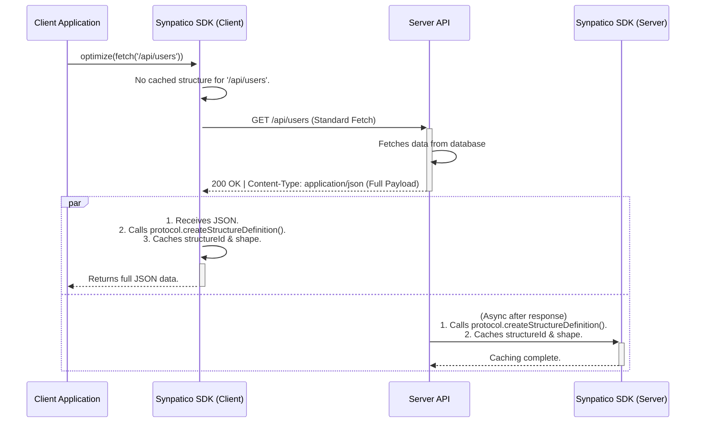
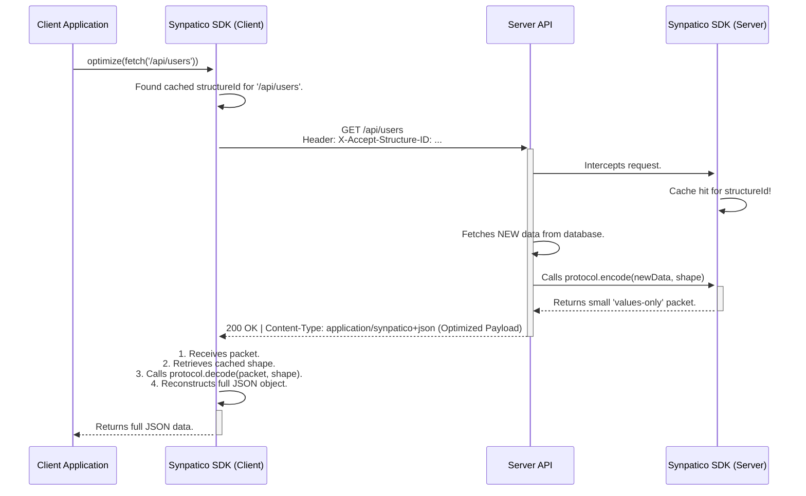

Synpatico: API Optimization Protocol Summary

How it Works: Synpatico uses a two-layer optimization strategy:

 - Layer 1 (Key Elimination): After an initial handshake, Synpatico stops sending repetitive JSON keys over the wire. Instead, it sends only a single, unique structureId and a flat array of values, which the client can use to perfectly reconstruct the original object. This dramatically reduces the payload size for repetitive data.

 - Layer 2 (Field Elimination): By using an optional client-side state tracker, Synpatico can learn which data fields the application actually uses. On subsequent requests, the server can send a packet containing only the values for those specific fields, further reducing the payload size.

1. The Core Concept: "Standard JSON First"
The elegance of the Synpatico protocol is that it is gracefully progressive. It does not require a complex initial negotiation that slows down the user's first experience.

 - The First Request is Normal: The very first time a client requests data from an endpoint, it receives a standard application/json response. The payload is un-optimized, fast, and cacheable by any standard web proxy.

 - Symmetrical Learning: After this first exchange is complete, both the client and the server independently and asynchronously run the data through the structure-id algorithm. Since the algorithm is deterministic, both sides generate the exact same structureId for the data's shape.

 - Caching the Structure: Both client and server cache this structureId and its corresponding "shape definition," which is a blueprint for reconstructing the object.

 - Optimized Subsequent Requests: From now on, the client knows the structureId for this API endpoint. On its next request, it adds a simple HTTP header (X-Accept-Structure-ID: <id>) to signal that it's ready to receive an optimized payload. The server sees this header, finds the matching structure in its cache, and sends back the highly compressed values-only packet.

1. Flowchart: The First Request (The Learning Phase)
This flowchart illustrates how both client and server learn the data structure from a standard JSON API call, preparing them for future optimizations.



4. Flowchart: Subsequent Requests (The Optimization Phase)
This flowchart shows the highly efficient path for all requests after the first one.



5. How Synpatico Decreases Bandwidth
Synpatico achieves its significant bandwidth reduction through its intelligent serialization strategy.

Key Elimination
This is the primary optimization. Instead of sending a full JSON object with verbose, repetitive keys, Synpatico sends a packet containing only the data's values.

Standard JSON Payload (~215 bytes):

```json
{
  "users": [
    { "id": 1, "username": "alice", "status": "active" },
    { "id": 2, "username": "bob", "status": "inactive" }
  ]
}
```

Synpatico values-only Payload (~85 bytes):

```json
{
  "structureId": "L0-...",
  "values": [1, "alice", "active", 2, "bob", "inactive"]
}
```

Standard Keys: A consistent ~37% reduction in payload size.

Descriptive Keys: A reduction of ~60-70% or more.

The protocol also includes a robust mechanism for preserving rich JavaScript types (like Date, Map, and Set) during this process, ensuring perfect data integrity upon reconstruction.